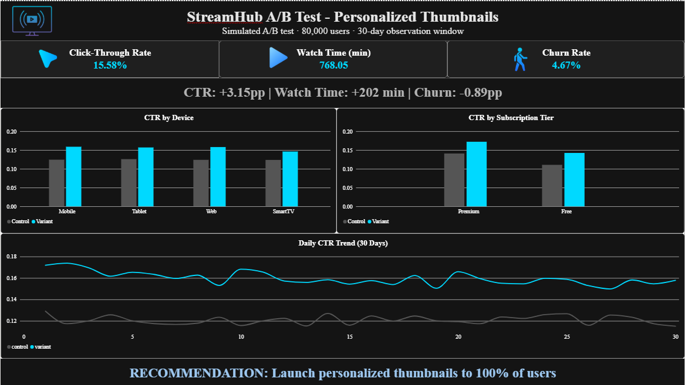

# StreamHub A/B Test — Personalized Thumbnails

A full end-to-end A/B testing portfolio project analyzing whether personalizing 
thumbnail artwork (based on viewing history) improves engagement and retention 
on a fictional Netflix-style OTT platform — inspired by Netflix's real published 
work on artwork personalization.

## Business Question

If StreamHub personalizes thumbnail artwork per user, will it meaningfully 
improve engagement (clicks, watch time) — and just as importantly, will it 
help or hurt subscriber retention?

## Dashboard

An interactive Power BI dashboard summarizing the core findings: KPI cards for 
CTR, watch time, and churn, a lift summary, CTR breakdowns by device and 
subscription tier, a 30-day daily CTR trend, and a final launch recommendation.

## Dataset

**streamhub_ab_test_data.csv** — 80,075 rows, split roughly 50/50 between 
Control and Variant, tracked over a 30-day test window.

| Column | Meaning |
|---|---|
| user_id | Unique user identifier |
| group | control or variant |
| region | India / USA / UK / Southeast Asia / Other |
| device | Mobile / Smart TV / Web / Tablet |
| subscription_tier | Free or Premium |
| browse_impressions | How many times thumbnails were shown to this user |
| title_clicks | How many thumbnails they clicked |
| total_watch_minutes | Total minutes watched over the 30 days |
| sessions_count | Number of distinct viewing sessions |
| completed_titles | Number of titles watched to completion |
| churned_30d | Whether they cancelled/went inactive during the window |

**streamhub_daily_trend.csv** — daily aggregated impressions/clicks/CTR per 
group, for all 30 days.

The raw data was **not pre-cleaned** — it contained missing values, duplicate 
rows, duplicate user IDs with conflicting data, impossible values (clicks 
greater than impressions, negative watch minutes), and inconsistent text 
formatting. All of this was identified and resolved (see Data Cleaning below).

## Data Cleaning Summary

- **Shape:** Raw dataset had 80,075 rows and 11 columns.
- **Missing values:** region (150), device (90), total_watch_minutes (120).
- **Duplicates:** 55 exact duplicate rows removed; 75 conflicting duplicate 
  user_ids resolved by keeping the first occurrence.
- **Impossible values:** 40 rows had title_clicks > browse_impressions 
  (capped to equal browse_impressions); 25 rows had negative 
  total_watch_minutes (corrected via absolute value).
- **Text standardization:** device casing standardized to Mobile / Web / 
  Smart TV / Tablet; region whitespace trimmed (with a "Southeast Asia" 
  edge case caught and fixed).
- **Missing value handling:** region/device nulls filled with "Unknown"; 
  total_watch_minutes nulls filled with the median (606.4), chosen over the 
  mean due to right-skew.
- **Final result:** exactly 80,000 clean, unique rows.
- **Derived metric:** click_through_rate = title_clicks / browse_impressions, 
  with no division-by-zero cases found.

## Methodology

The analysis follows a structured six-section framework:

1. **Data Cleaning & Validation** — shape, nulls, duplicates, impossible 
   values, text standardization, CTR calculation.
2. **Organize, Pivot & Visualize** — pivot tables, distribution analysis, 
   comparison charts.
3. **Ethics Check** — Risk, Benefit, Choice/Alternatives, and Data Sensitivity 
   review.
4. **Choosing Metrics** — primary, secondary, and guardrail metric selection; 
   statistical method justification.
5. **Experiment Design** — unit of diversion, cohort design rationale, 
   required sample size calculation.
6. **Statistical Analysis** — Sample Ratio Mismatch check, significance 
   testing on all three core metrics.
7. **Segments & Learning Effects** — breakdown by device and subscription 
   tier, daily trend analysis for novelty effects.
8. **Final Recommendation** — executive summary for stakeholders.

## Key Results

| Metric | Control | Variant | Lift |
|---|---|---|---|
| Click-Through Rate | 12.43% | 15.58% | **+3.15pp** |
| Avg. Watch Time (min) | 565.88 | 768.05 | **+202.16 min** |
| 30-Day Churn Rate | 5.56% | 4.67% | **−0.89pp** |

All three results were statistically significant (p < 0.001) with tight, 
zero-excluding confidence intervals:
- **CTR:** two-proportion z-test, |z| = 138.73, 95% CI [0.0311, 0.0320]
- **Watch Time:** Welch's t-test (t = 84.132) validated via bootstrap 
  (3,000 resamples), 95% CI [197.50, 207.06]
- **Churn:** two-proportion z-test, z = 5.697, p = 1.22e-08, 
  95% CI [−0.0119, −0.0058]

**Sample size:** required minimum was ~4,432 users/group for a 2pp CTR lift 
at 95% confidence and 80% power. The dataset had ~40,000 users/group — 
roughly 9x the minimum, making the test well-powered.

**Sanity check:** Sample Ratio Mismatch test passed (χ² = 0.0000, p = 1.0000) — 
the 50/50 randomization worked correctly.

## Segment & Learning Effect Findings

- **By device:** All five segments showed statistically significant lift 
  (p < 0.001). Mobile had the strongest lift (+3.46pp), followed by Web 
  (+3.41pp) and Tablet (+3.11pp). **Smart TV showed the smallest lift 
  (+2.25pp)** — likely because large-screen viewers browse more deliberately 
  and rely less on thumbnail details than mobile/web/tablet users who scroll 
  quickly.
- **By subscription tier:** Free (+3.17pp) and Premium (+3.14pp) behaved 
  almost identically — no Simpson's Paradox surprise.
- **Over time:** The CTR lift stayed stable across all 30 days with no 
  shrinking gap — confirming a genuine, lasting effect rather than a fading 
  novelty reaction.

## Ethics Review

Classified as **low-risk and low-to-moderate data sensitivity**. Users cannot 
opt out and are silently assigned to a group, but core app functionality 
remains identical in both groups. Viewing history — while seemingly harmless — 
can reveal sensitive information (mental health, sexual orientation, religious 
or political views), so it should be anonymized, stored securely, and used 
strictly for personalization. Standard team-level review is sufficient; no 
formal ethics board escalation required.

## Final Recommendation

**Launch personalized thumbnails to 100% of users.** This is a rare 
**"triple win"** — higher engagement, higher watch time, *and* improved 
retention — with no guardrail metric showing harm.

**Next steps:** Test whether combining personalized thumbnails with 
personalized preview trailers compounds the effect further, and investigate 
alternative personalization approaches better suited to the Smart TV / 
living-room viewing context.

## Repository Contents

- `Dataset/` — raw data, checked/validated data, cleaned data, and daily 
  trend data
- `Python/` — Jupyter notebook (`StreamHub_AB_Test_Analysis.ipynb`) with the 
  full 22-question analysis, plus supporting chart exports
- `PowerBI/` — Power BI dashboard file (`StreamHub_Dashboard.pbix`) and its 
  supporting summary CSVs (KPI, device, tier)
- `streamhub_queries.sql` — MySQL Workbench queries (GROUP BY, CASE 
  statements, a CTE, and a window function/RANK), cross-validated against 
  the Python results
- `Problem_Statement.pdf` — original project brief and requirements
- `StreamHub_AB_Test_Report.pdf` — full written report answering all 22 
  questions in stakeholder-readable format
- `streamhub_dashboard.png` — dashboard screenshot (shown above)

## Tools & Skills Used

Python (Pandas, NumPy, Matplotlib, Seaborn, SciPy/statsmodels), SQL 
(MySQL Workbench), Excel, Power BI, statistical hypothesis testing 
(z-tests, Welch's t-test, bootstrap resampling, chi-square/SRM check, 
power analysis), and A/B test experiment design.

